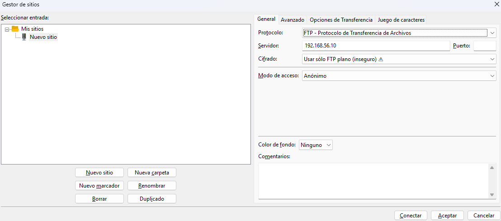
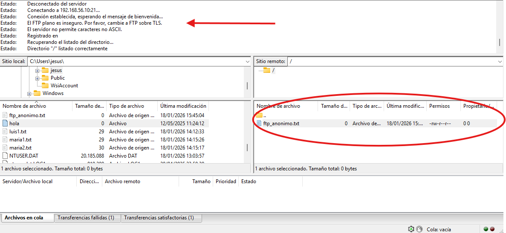
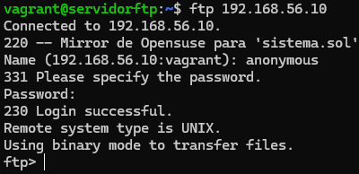
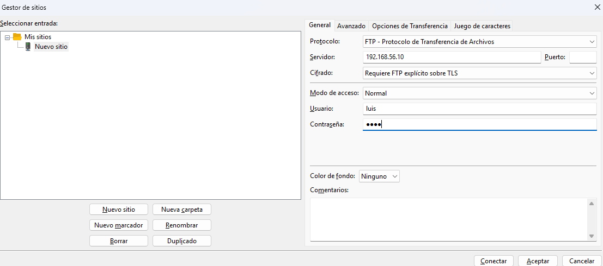
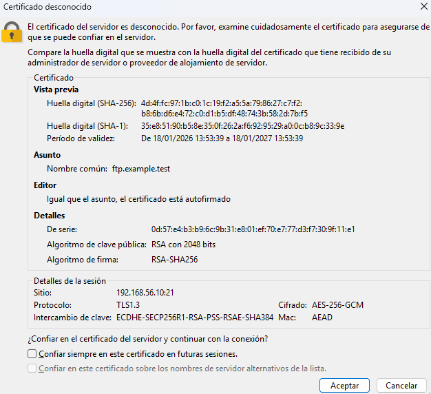
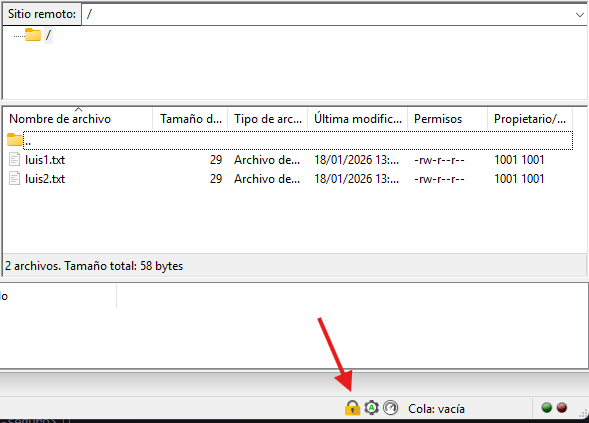

# ProyectoFTP
## Características del Proyecto

Este proyecto esta compuesto por dos tipos de servidores FTP. Uno anónimo, en el que los usuarios pueden conectarse sin necesidad de estar registrados. Y otro que usa un certificado ssl para asegurar la protección de los datos que viajan entre servidor y cliente.

## Requisitos
* [Vagrant](https://developer.hashicorp.com/vagrant/install)
* [Oracle Virtualbox](https://www.virtualbox.org/wiki/Downloads)
* [Filezilla](https://filezilla-project.org/download.php?type=client)
---
 **[Enunciados del Proyecto](https://github.marinettoo.es/ProyectoFTP)**

---

## FTP Anónimo
[Enunciado del proyecto](https://github.marinettoo.es/ProyectoFTP/ftp-anonimo.html)

En este servidor, la configuración permite el acceso a usuarios desconocidos ("anonymous"), ideal para compartir archivos públicos.
* 📂 **Carpeta:** `/ftp-anonimo/`

### ¿Como deplegarlo?

* Abriremos la terminal e iremos a la carpeta de FTP anonimo `cd ftp-anonimo`.

* Usaremos el comando `vagrant up` para arrancar la máquina virtual.
    * Se instalarán automaticamente las dependencias y configuraciones del servidor.

* Una vez haya arrancado, nos conectaremos al servidor:

    - **Usando filezilla (Windows-Linux)**
        * Abriremos filezilla y pulsaremos `Ctrl + S`.
        * Se nos abrirá el siguiente cuadro y lo rellenaremos de la siguiente manera:

        * Pondremos la dirección IP configurada een el archivo Vagrantfile (192.168.56.10)
    

* Una vez hayamos conectado, podremos ver la siguiente pantalla, que nos muestra los archivos dentro del servidor FTP y que la conexión ha sido correcta:

    >***NOTA**: Filezilla no mostrará el mensaje de bienvenida.* 
     

- **Usando la terminal de linux**
    * Dentro de la maquina `vagrant ssh`. Nos aseguraremos de que tenemos el programa básico **ftp**. Si no, lo instalaremos usando el comando `sudo apt update && sudo apt install ftp -y`. 
    * Una vez esté instalado, nos conectaremos al servidor usando `ftp 192.168.56.10`.
    * Nos pedirá el nombre: **anonymous**
    * Nos pedirá la contraseña: **Lo dejaremos en blanco**
    * Deberia entrar sin problema

>***Nota:*** *Aquí si podremos ver el mensaje de bienvenida.*

### ¿Qué funciona?
| Acción | Resultado Esperado |
| :--- | :--- |
| **Entrar como anónimo** | Debe dejarnos entrar sin pedir contraseña. |
| **Mensaje de bienvenida** | Debe salir el texto "Mirror de Opensuse...". |
| **Descargar archivos** | Podremos descargar archivos a nuestro ordenador. |
| **Subir archivos** | **NO** nos dejará subir nada (Error 550). |
| **Crear/Borrar** |  **NO** nos dejará crear carpetas ni borrar. |

---

## FTP Seguro
[Enunciado del proyecto](https://github.marinettoo.es/ProyectoFTP/ftp-seguro.html)
En este servidor, la configuración implementa cifrado SSL/TLS (FTPS), ideal para usuarios registrados que necesitan transferir información sensible asegurando que nadie pueda interceptar las contraseñas ni los archivos.
* 📂 **Carpeta:** `/ftp-seguro/`

### Usuarios Configurados
| Usuario | Contraseña | Estado (Chroot) | Permisos |
| :--- | :---: | :--- | :--- |
| **luis** | `1234` | **Enjaulado** | Solo ve su carpeta `/home/luis` |
| **miguel** | `1234` | **Enjaulado** | Solo ve su carpeta `/home/miguel` |
| **maria** | `1234` | **LIBRE** | Puede navegar por todo el sistema `/` |
| **anonymous**| (vacía) |**Enjaulado** | Solo lectura en carpeta pública |

### ¿Cómo desplegarlo?

* Abriremos la terminal e iremos a la carpeta de FTP seguro: `cd ftp-seguro`.

* **IMPORTANTE:** Si tienes la máquina del FTP anónimo encendida, debes apagarla antes (`vagrant halt`), ya que usan la misma IP.

* Usaremos el comando `vagrant up`.
    * Ansible generará automáticamente los **certificados SSL autofirmados**, creará los usuarios y configurará el cifrado.

### ¿Cómo conectarse?

La conexión es diferente porque requiere cifrado estricto.

- **Usando Filezilla (Recomendado)**
    * Abriremos el Gestor de Sitios (`Ctrl + S`).
    * Configuraremos la conexión así:
    

    
    * **Servidor:** `192.168.56.10` 
    
        * **Cifrado:** `Requiere FTP explícito sobre TLS` (Si no pones esto, el servidor rechazará la conexión).
        * **Usuario:** `luis` (o cualquier otro de la tabla).
        * **Contraseña:** `1234`

    * Al conectar, saltará un **Aviso de Certificado Desconocido**.
        * Esto es normal porque el certificado lo hemos creado nosotros y no una autoridad oficial.
        * Marcaremos "Confiar siempre en este certificado" y aceptaremos.

 **Si todo ha ido bien, veremos el candado cerrado  en la esquina inferior y nuestros archivos.**

### ¿Qué funciona?

| Acción | Resultado Esperado |
| :--- | :--- |
| **Cifrado** | Debe aparecer un candado y el log "Conexión TLS establecida". |
| **Usuarios Locales** | Luis, Miguel y María entran con contraseña `1234`. |
| **Luis/Miguel** | **NO** pueden subir al directorio padre (`..`). |
| **María** |  **SÍ** puede subir y ver todo el sistema. |
| **Conexión Insegura** |  Si intentamos conectar sin TLS, el servidor nos expulsa. |

---

## Tarea Adicional: Configuración DNS
Hemos configurado un servidor DNS real (usando Bind9) dentro de la misma máquina. Esto nos permite conectarnos usando un nombre de dominio en lugar de tener que recordar la IP.

* **Dominio configurado:** `ftp.example.test`
* **IP que resuelve:** `192.168.56.10`

### ¿Cómo funciona?
Hemos creado un playbook adicional llamado `dns.yml` que se encarga de:
1. Instalar el servidor DNS Bind9.
2. Crear la zona `example.test`.
3. Configurar la máquina para que utilice su propio servidor DNS.

### ¿Cómo comprobar que funciona?

**Comprobar la resolución (nslookup)**
Usaremos el comando `nslookup ftp.example.test`. Si funciona, nos debe devolver la IP de nuestro servidor.

**Conexión FTP usando el nombre**
En lugar de poner la IP, nos conectaremos usando el nombre del dominio.
* Comando: `ftp ftp.example.test`

| Acción | Resultado Esperado |
| :--- | :--- |
| **Ping / nslookup** | El comando `nslookup ftp.example.test` devuelve `192.168.56.10`. |
| **Conexión FTP** | Podemos entrar al servidor usando el nombre en vez de la IP. |

---

## Calidad del Código (Ansible-Lint)
Para garantizar que el código de automatización sigue las mejores prácticas y no tiene errores de sintaxis, se ha verificado el playbook usando la herramienta `ansible-lint`.

**Debemos asegurarnos de tener ansible-lint instalado en nuestra maquina. Si no lo tenemos, lo instalaremos con el comando `sudo apt update && sudo apt install ansible-lint -y`**

* Esta es la salida que debe de darnos (nada):

* En caso de errores, nos indicará el error y la linea en la que está

---
